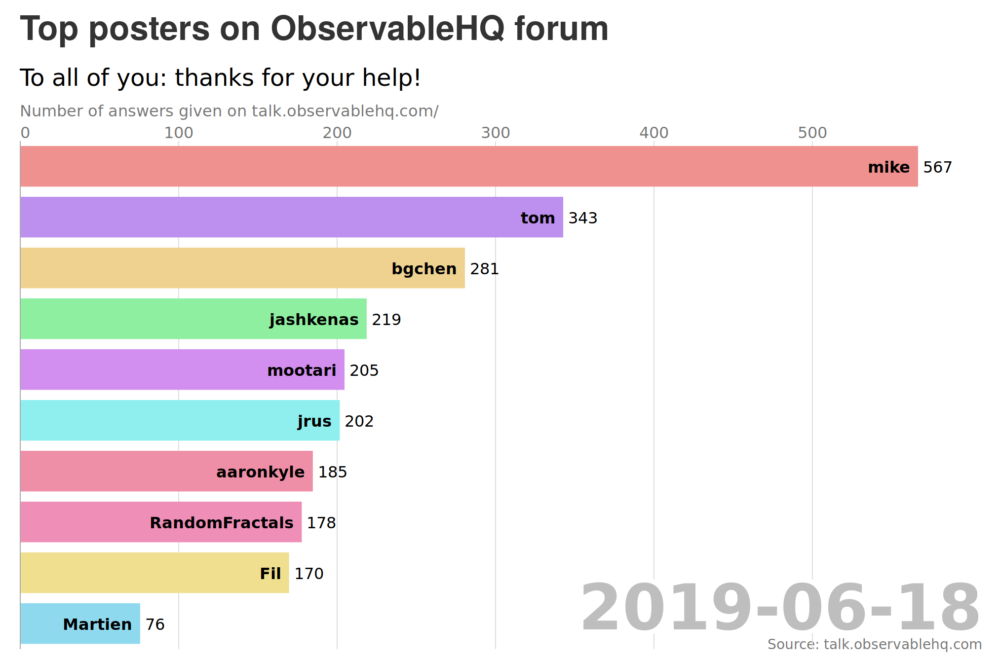

# README

All posts on the https://talk.observablehq.com Discourse instance.

Used in the [Top posters on ObservableHQ forum](https://observablehq.com/@severo/top-posters-on-observablehq-forum) bar chart race data visualization.



## Data

- [posts.csv](./posts.csv): all posts on https://talk.observablehq.com.

  ```csv
  "post_id","user","date","is_accepted_answer"
  "7339","jrus","2019-08-05T04:44:08.403Z","FALSE"
  "7338","jrus","2019-08-03T23:19:44.634Z","FALSE"
  "7337","bgchen","2019-08-03T23:06:59.237Z","FALSE"
  "7336","jrus","2019-08-03T21:38:16.123Z","FALSE"
  "7335","MarioDelgadoSr","2019-08-02T18:11:47.794Z","FALSE"
  "7334","vorth","2019-08-02T03:21:51.036Z","FALSE"
  ...
  ```

In Discourse platforms, the _posts_ form the discussion below a _topic_. As https://talk.observablehq.com serves as the help forum for https://observablehq.com, topics are generally the questions whereas posts are the answers. The columns of [posts.csv](./posts.csv) are:

- `post_id`: identifier of the post on https://talk.observablehq.com
- `user`: user who wrote the post
- `date`: date of the post
- `is_answer`: is the post the accepted answer for the topic? (boolean)

The [posts.csv](./posts.csv) file corresponds to data extracted on 2019/08/05.

## Rebuild the data

To update the [posts.csv](./posts.csv) file, launch the R script (it takes about 5 minutes):

```bash
Rscript get_data_from_talk_observable.R
```

The R script uses jsonlite, dplyr and glue.
